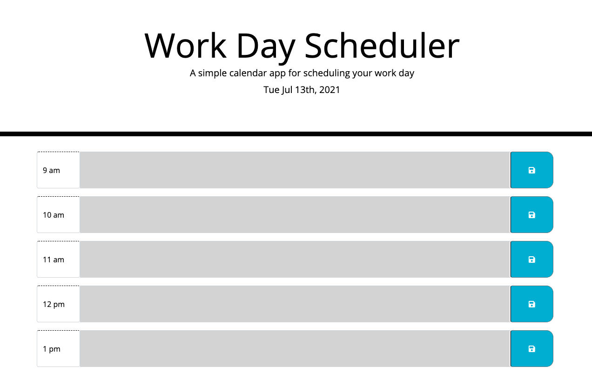

# Work-Day-Scheduler
## Overview
For this assignment we were tasked to create a work day scheduler. We had to create inputs for each work hour and have the inputs be saved in the local storage so that they appeared once the screen was refreshed. We also had to have the input sections change color depending on the hour of the day. If the hour matched the input time block the section was red, if it the time block was yet to be reached it would be green and if past the block is gray.




## Acceptance Criteria
```
GIVEN I am using a daily planner to create a schedule
WHEN I open the planner
THEN the current day is displayed at the top of the calendar
WHEN I scroll down
THEN I am presented with timeblocks for standard business hours
WHEN I view the timeblocks for that day
THEN each timeblock is color coded to indicate whether it is in the past, present, or future
WHEN I click into a timeblock
THEN I can enter an event
WHEN I click the save button for that timeblock
THEN the text for that event is saved in local storage
WHEN I refresh the page
THEN the saved events persist
```

## Learning

With this assignment I was able to practice creating pages using bootstrap. I was also able to dive into the worl of Jquery and get my feet wet in learning how to manuever the dom with it. I was also able to learn how to use moment in order to capture time and format it in different ways.